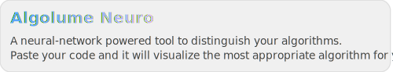

#  [Algolume](https://algolume.ru)

A tool to visualize programming algorithms step-by-step. Explore algorithm theory and visualize examples or **your own code**!  

- **Theory and Run examples**: Read the theory and then visualize the given code implementation.
- **Custom Visualizations**: You are able to visualize **your code** as well!!! Select variables in it to build algorithm visualizations on. We use our own debugging system built on Python to get the execution trace. The visualization is based on the execution process, so you can see the algorithm visualization right at each step of your program, as well as all the variables and other code components at that step!
- **Algolume Neuro**: Skip the list—paste the code of your algorithm. Neuro will detect it and visualize. You can view the neuro component of my project here: [AlgoScout](https://github.com/iskochergin/AlgoScout).

<a href="https://algolume.ru" target="_blank" rel="noopener">
  <picture>
    <source
      media="(prefers-color-scheme: dark)"
      srcset="./media/algolume-neuro-dark.svg"
    >
    
  </picture>
</a>

---

By this moment there are 5 algorithms available:

- DP (Turtle task)
- DP (Grasshopper task)
- DFS
- BFS
- Dijkstra's
- Z-function
- Prefix-function

Planning to add:
- DSU
- Prim’s
- Quadtree
- Segment Tree
- Kruskal’s
- Fenwick Tree

---

*No setup required. Ideal for learning, debugging, or teaching!*
#### Get into it and check how it works!

> Also, you can simply access our Python debugging system by [algolume.ru/debug](https://algolume.ru/debug) and try to debug any python code you have.
